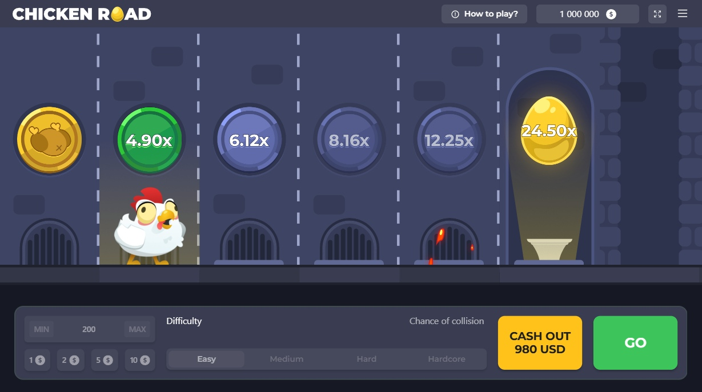

# Chicken Road Casino

Officially launched on April 4, 2024, **Chicken Road** has already captured the hearts of thousands of players worldwide. This casino mini-game, exclusive to certain major operators, offers a unique experience that blends strategy and luck. Your mission is to guide a chicken through a dungeon filled with obstacles while avoiding flames that can set everything on fire! It’s not like any other game, but with a RTP of 98% and the chance to win up to $20,000, thrill-seekers will feel right at home. Ready to test your nerves ?

## How to Play Chicken Road ?

The game’s concept is easy to understand but offers an exciting challenge with every round. Here’s how it works :

1. **Choose your bet** : Before starting, adjust your bet. You can wager between $0.01 and $200, depending on your budget and strategy.
2. **Cross the dungeon** : The goal is to get the chicken through a dungeon step by step. Each successful crossing brings you closer to a payout, with a multiplier increasing at each level.
3. **Avoid the flames** : Be cautious of flames that might appear and roast your chicken before reaching the jackpot. If you manage to avoid being burned, you can cash out and take your winnings before things go south.
4. **Make your choices** : You can select from different difficulty levels (Normal, Hard, Hardcore), which influence your chances of progressing further, as well as the risks. The higher the risk, the higher the reward!

⏩⏩⏩[**Start Playing Chicken Road Now and Test Your Luck !**](https://fspace.link/register) 

## Where to Play Chicken Road?

**Chicken Road** is available at all casinos partnered with Inout Games, as well as exclusively on certain major platforms. Playing this thrilling game is now easier than ever, with full accessibility on both mobile and desktop devices. The partnered casinos are known for their reliability and security, ensuring a worry-free experience.

### Play on Mobile

Thanks to HTML5 technology, **Chicken Road** is fully compatible with all mobile devices. There’s no need to download anything! Simply open the game directly on your smartphone or tablet, log in to your preferred online casino, and start playing. The interface automatically adjusts to your screen for an optimal gaming experience, wherever you are.

⏩⏩⏩[**Play Chicken Road on Your Favorite Casino Platform Today !**](https://fspace.link/register) 

## Game Features and Characteristics

- **98% RTP**: A 98% return to player, with frequent payouts and an exciting gameplay experience.
- **Betting between $0.01 and $200**: Bet according to your comfort level and maximize your chances based on your budget.
- **Maximum Win of $20,000**: The ultimate jackpot for those who take the necessary risks.
- **High Volatility**: Guaranteed thrills with high volatility, where the rewards can be massive.

⏩⏩⏩[**Discover the Features and Win Big in Chicken Road !**](https://fspace.link/register) 

## Strategies and Tips to Win at Chicken Road

### 1. Don’t Be Too Greedy!

The game rewards those who know when to stop. Take your winnings before risking too much and ending up "roasted." A smart cashout at the right time might be the key to a big win.

### 2. Choose Your Difficulty Wisely

The harder the mode, the higher the risks, but also the bigger the rewards. The **Hard** or **Hardcore** modes may seem intimidating, but they also offer greater chances of hitting the $20,000 jackpot.

### 3. Manage Your Bankroll

As with any casino game, managing your budget is crucial. Don’t put all your money on one round. Spread your bets across multiple rounds to maximize your chances of success.

### 4. Take Your Time Before Taking Risks

Each time you cross a stage, you can cash out. Don’t rush; make sure to think carefully before risking it all. Ultimately, you control the game.

⏩⏩⏩[**Apply These Winning Tips and Win Big on Chicken Road !**](https://fspace.link/register) 
